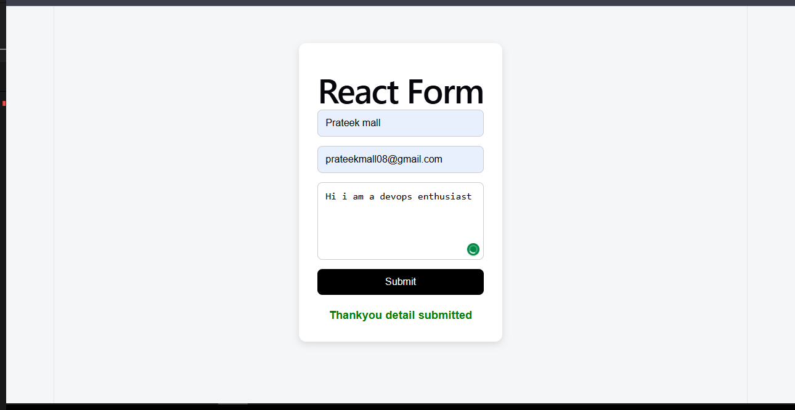

# 🚀 Full Stack App Deployment on AWS EKS

This project demonstrates an end-to-end deployment of a full-stack application using Kubernetes (EKS) with CI/CD pipelines.

## 🔗 Repositories

* 🔹 Frontend (React): https://github.com/prateek0007/react-form-frontend
* 🔹 Backend (Spring Boot): https://github.com/prateek0007/java-form-backend

## 🏗️ Architecture

User → Frontend (React) → Backend (Spring Boot API) → Response

Both services are deployed on AWS EKS using Kubernetes.

(./images/fulstack-backend architecture.png)

## ⚙️ Tech Stack

* React (Frontend)
* Spring Boot (Backend)
* Docker
* Kubernetes (EKS)
* GitHub Actions (CI/CD)
* AWS (EKS, EC2)

## 🚀 Features

* Separate CI/CD pipelines for frontend & backend
* Dockerized applications
* Kubernetes deployments and services
* LoadBalancer exposure
* End-to-end API integration

## 🌐 Live Flow

1. Open frontend LoadBalancer URL
2. Fill the form
3. Data sent to backend API
4. Response: "Thankyou detail submitted"

## 📸 Screenshots
![Frontend]
(./images/Frontend_ss.png)

## 🧠 Learnings

* EKS cluster setup and node group management
* RBAC configuration using aws-auth
* CI/CD automation
* Debugging real-world Kubernetes issues

## 🔥 Future Improvements

* Ingress + Domain
* HTTPS (TLS)
* Auto-scaling (HPA)
* Helm charts

