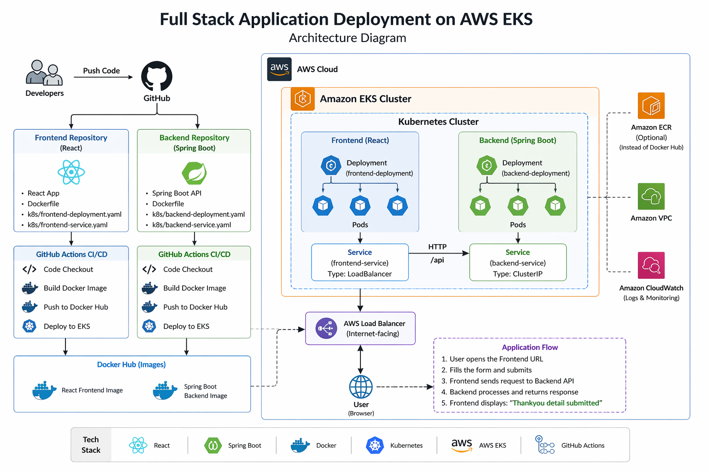
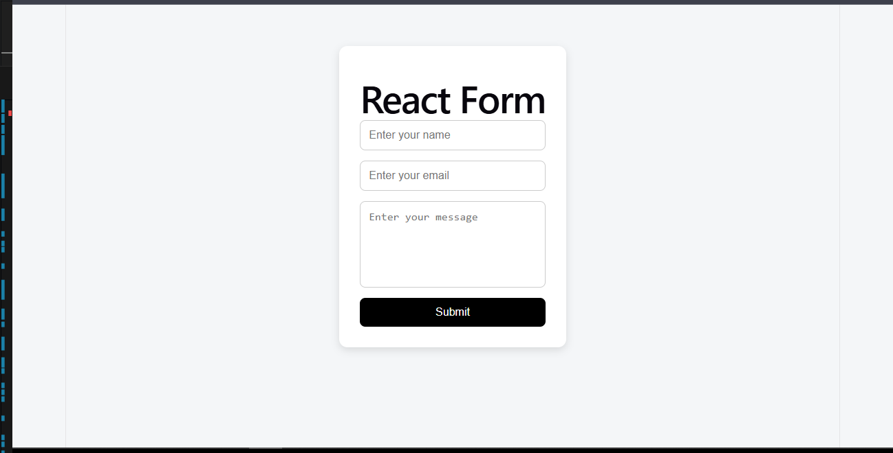

# 🚀 Full Stack App Deployment on AWS EKS

This project demonstrates an end-to-end deployment of a full-stack application using Kubernetes (EKS) with CI/CD pipelines.

## 🔗 Repositories

* 🔹 Frontend (React): https://github.com/prateek0007/react-form-frontend
* 🔹 Backend (Spring Boot): https://github.com/prateek0007/java-form-backend

## 🏗️ Architecture

User → Frontend (React) → Backend (Spring Boot API) → Response

Both services are deployed on AWS EKS using Kubernetes.




## ⚙️ Tech Stack

* React (Frontend)
* Spring Boot (Backend)
* Docker
* Kubernetes (EKS)
* GitHub Actions (CI/CD)
* AWS (EKS, EC2)

## 🚀 Features

* Separate CI/CD pipelines for frontend & backend
* Dockerized applications
* Kubernetes deployments and services
* LoadBalancer exposure
* End-to-end API integration

## 🌐 Live Flow

1. Open frontend LoadBalancer URL
2. Fill the form
3. Data sent to backend API
4. Response: "Thankyou detail submitted"

## 📸 Screenshots
FRONTEND


RESPONSE


## 🧠 Learnings

* EKS cluster setup and node group management
* RBAC configuration using aws-auth
* CI/CD automation
* Debugging real-world Kubernetes issues

## 🔥 Future Improvements

* Ingress + Domain
* HTTPS (TLS)
* Auto-scaling (HPA)
* Helm charts

## 🔐 Challenges & Fixes

### 1️⃣ EKS Authentication Issue

**Problem:**
While Performing GitHub Actions with `kubectl` Error:

```
the server has asked for the client to provide credentials
```

**Fix:**
Configured `aws-auth` ConfigMap to map IAM user with Kubernetes RBAC:

* Added GitHub Actions IAM user to `system:masters` group
* Enabled CI/CD pipeline to access EKS cluster

---

### 2️⃣ Node Group Creation Failure

**Problem:**
EKS node group creation failed with CloudFormation timeout.

**Fix:**

* Checked CloudFormation logs
* Fixed IAM role permissions
* Recreated node group successfully

---

### 3️⃣ Frontend → Backend Connectivity Issue

**Problem:**
Frontend showed "Something went wrong" on form submission.

**Fix:**

* Exposed backend using LoadBalancer service
* Updated frontend API URL with external IP
* Verified API response using Postman

---

### 4️⃣ Docker Image Push Error

**Problem:**

```
tag does not exist
```

**Fix:**

* Rebuilt Docker image with correct tag
* Ensured consistent naming between build and push

---

### 5️⃣ Port Already in Use

**Problem:**
Spring Boot failed to start due to port conflict.

**Fix:**

* Identified running process
* Changed backend port configuration

---

### 6️⃣ Kubernetes Deployment Failure (CI/CD)

**Problem:**

```
failed to download openapi: the server has asked for the client to provide credentials
```

**Fix:**

* Configured AWS credentials in GitHub Actions
* Updated kubeconfig dynamically using `aws eks update-kubeconfig`

---

### 7️⃣ YAML Configuration Errors

**Problem:**
Incorrect `aws-auth` structure caused deployment issues.

**Fix:**

* Corrected YAML indentation
* Separated `mapRoles` and `mapUsers` properly


### 🔥 Key Takeaway
This project helped me understand real-world DevOps challenges beyond just deployment — especially authentication, networking, and CI/CD debugging in Kubernetes environments.
